## Organize-se!

1.  Crie um novo diretório (pasta) para armazenar seus projetos de calibração.

    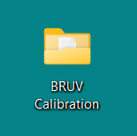

2.  Dentro desta pasta, crie novos diretório (multiplas pastas) para cada configuração de BRUV. Estas distinções se baseiam principalmente na resolução da câmera utilizada e no campo de visão (*Field of View*).

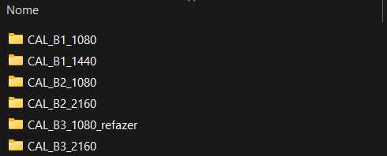

3.  Dentro das respectivas pastas de BRUV, **cole** os respectivos os arquivos de vídeo (**.MP4**). Lembre-se, serão dois, um da câmera esquerda (E) e outro da câmera direita (D).

    

    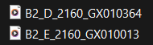

::: {.callout-tip appearance="simple"}
Para facilitar, **renomei** os arquivos de vídeo (.MP4) conforme a **ID do BRUV**, o **lado da câmera** e a **resolução** utilizada, seguindo nescessáriamente esta ordem. Ao final, **mantenha o nome do arquivo original** gerado pela câmera. Não utilize espaços nem caracteres especiais.

Ex: B2_D_2160_GX010364 (*bruvID_lado_resolucao_nome original*).
:::

4.  Na mesma pasta de trabalho, adicione também a **cópia** do arquivo de calibração do cubo (**.PtsCAL**).

    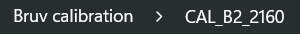

    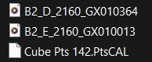

::: {.callout-caution appearance="simple"}
O arquivo de calibração do cubo (**.PtsCAL**) variam de acordo com o modelo de cubo de calibração utilizado. Estes arquivos são fornecidos pela SeaGIS no momento da compra. Se necessário, contacte a representação da empresa.
:::

5.  Além disso, adicione o arquivo de parâmetros da câmera (**.CamCAL**), conforme modelo e configuração empregada. Estes arquivos são fornecidos pela SeaGIS, no site: <https://www.seagis.com.au/download.php>.

    

    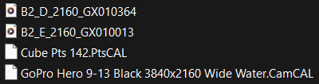

6.  Ao final, você terá, normalmente, 04 (quatro) arquivos:

```         
-   Vídeo da Câmera Esquerda (.MP4);

-   Vídeo da Câmera Direita (.MP4);

-   Arquivo de calibração do cubo (.PtsCAL), conforme modelo.

-   Arquivo de parâmetros da câmera (.CamCAL), conforme modelo e resolução.
```

7.  Com o PEN-DRIVE fornecido pela SeaGIS conectado ao seu computador, inicie o programa de calibração CAL (Downloads: <https://www.seagis.com.au/download.php>)

8.  No CAL, crie um novo projeto através do menu: *Project \| New project*

    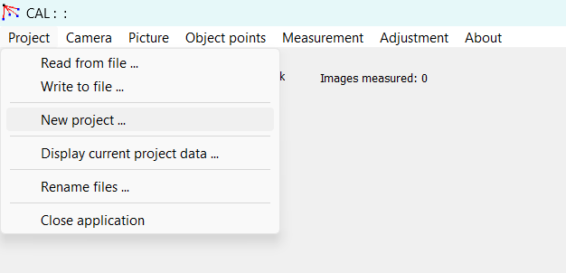

9.  Você será solicitado para salvar quaisquer dados não salvos associados ao projeto atual. Insira um nome para o arquivo do projeto (por exemplo, **“***ProjCAL_B2_2160***”**) e salve o arquivo do projeto no diretório que você acabou de criar para este projeto.

```         


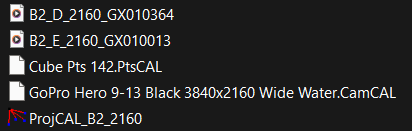

::: {.callout-note appearance="simple"}
A criação de um novo projeto inicia um processo de assistente do próprio programa que irá solicitar a configuração do restante do projeto. Basta seguir as instruções, lembrando que todos os arquivos estão localizados no mesmo diretório, e que o CAL usará, por padrão, o diretório onde o novo arquivo de projeto foi criado.
:::
```

10. Carregue os arquivos de parâmetro da câmera esquerda e direita (**.CamCAL**), conforme solicitado.

    ::: {.callout-caution appearance="simple"}
    Atenção! É um mesmo arquivo (**.CamCAL**) para ambas as câmeras, pois utilizamos em cada lado do BRUV câmeras de mesmo modelo e mesma configuração.
    :::

11. Carregue o arquivo do cubo de calibração (**.PtsCAL**), conforme solicitado.

12. Defina o diretório de imagens conforme solicitado.

    ::: {.callout-note appearance="simple"}
    **O diretório de imagens é automaticamente definido como o mesmo diretório do arquivo do projeto**; portanto, se todos os arquivos da calibração estiverem em um único diretório, basta verificar e clicar em **OK**.
    :::

13. O programe pedirá para que salve o novo arquivo de medições (**.ObsCAL**) que será atrelado ao projeto. **Basta atribuir um nome a esse arquivo** (por exemplo, **“***MeasureCAL_B2_2160***”**). Este arquivo será o local onde as medições da calibração serão armazenadas.

    ::: {.callout-note appearance="simple"}
    O programa também irá gerar um arquivo de *backup* automático das medições (**.ObsCAL_AUTO**).
    :::

    

    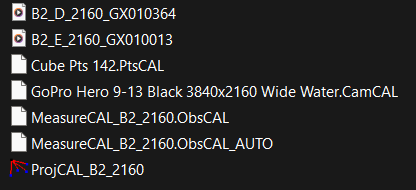

14. Carregue o arquivo de vídeo da câmera **ESQUERDA**. Ele será automaticamente adicionado à configuração da sequência de filmes. Caso existam mais arquivos de vídeo na sequência, eles podem ser adicionados nesse momento (ver **Sequências de filmes**). Em seguida, clique em **OK**.

15. Carregue o arquivo de vídeo da câmera **DIREITA**. Idem.

16. A janela *Current project files* (*Arquivos do projeto atual*) será exibida. **Todos os campos devem estar preenchidos** e todos os itens listados devem estar no **mesmo diretório**. Clique em *Close dialog* (*Fechar diálogo*).

    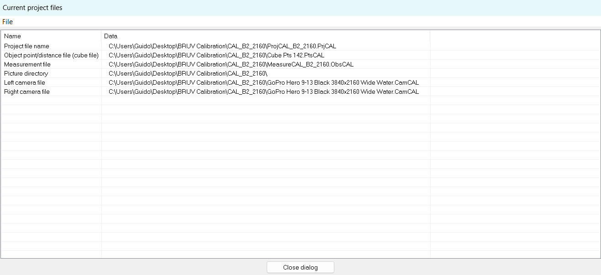

## Explore mais!

-   Se for em *Camera \| Left/Right \| Edit parameters*, você terá acesso as características ópticas da câmara.

    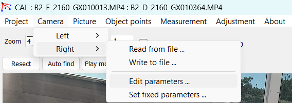

-   Essas informações são importantes quando se trabalha cientificamente com a visão.

    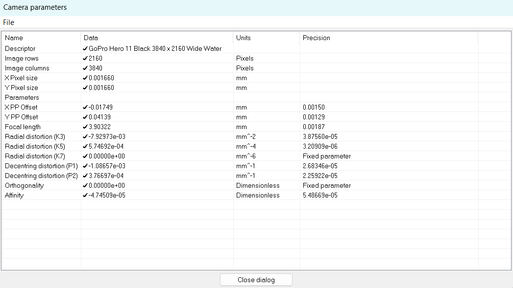

-   É importante sempre anotar a versão do programa. Essas informações devem constar na seção de métodos de possíveis manuscritos acadêmicos, pois representa o estado exato dos algorítimos dos calculos realizados pelo programa.

## Sincronizando Câmeras

1.  Plug o pen-drive no USB.

2.  Abra o programa CAL no seu computador (Downloads: <https://www.seagis.com.au/download.php>)

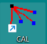

3.  Se você já tinha um projeto salvo, o programa abrirá automaticamente nele. Ele sempre reinicia no último projeto que você trabalhou.

    ::: {.callout-note appearance="simple"}
    Acho que dá para mudar isso nas configurações, é bom rever manual!
    :::

4.  Agora a gente vai sincronizar a câmera. Para isso clique em *Play movie* na câmera **esquerda**

    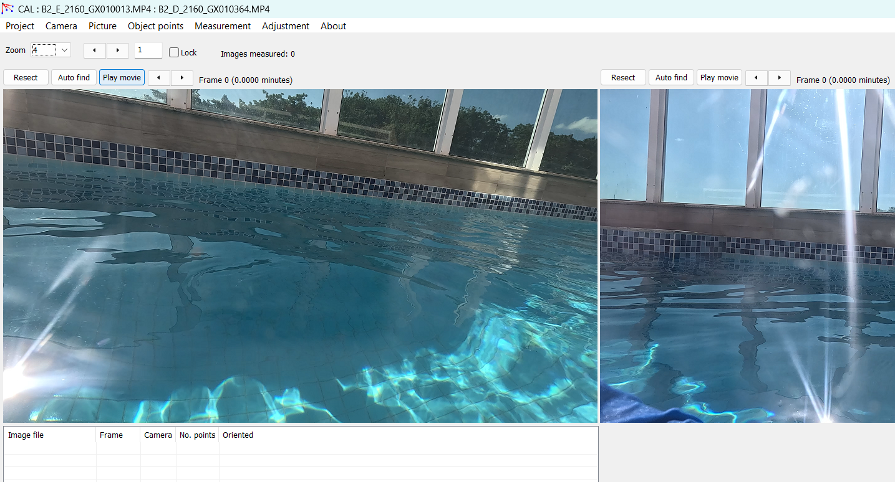

5.  É para esse momento que serve o bater palmas ou os dedos (movimentos de *clap*). Servindo de claquete para marcar o início da tomada, para gerarmos oo sincronismo audiovisual entre imagem e som.

    ::: {.callout-warning appearance="simple"}
    Antenção! Aviso das Galáxias!

    PRESTE MUITA ATENÇÃO A ESSE MOVIMENTO. ELE É UM MOVIMENTO FUNDAMENTAL PARA SINCRONIZAÇÃO DA FOTOGRAMETRIA.

    PODEMOS INVIABILIZAR TODA A AMOSTRAGEM E DESPEDIÇAR TODO O ESFORÇO DE CAMPO SE NÃO CONSEGUIRMOS SINCRONIZAR AS CÂMERAS.

    PERCEBERÁ QUE A AUSÊNCIA DESSE MOVIMENTO NA CALIBRAÇÃO DESPENDIRÁ DE SUA PARTE MUITO MAIS CAPRICHO E TEMPO PARA REALIZAR SEU TRABALHO.

    ESSE É UM ERRO COMUM DURANTE AS OPERAÇÕES DE CAMPO, POIS A UMA SERIES DE PASSOS QUE PRECISA SER SEGUIDOS E ACABAMOS POR NOS ESQUECER DOS MAIS SIMPLES.

    PORTANTO, NUNCA ESQUEÇA DE REALIZAR SEU CLAP ANTES DE LANÇAR OS BRUVS

    SUGIRO ATÉ QUE DESENVOLVA UM PRÓPRIO. BUSQUE MOVIMENTOS RÁPIDOS E PRECISOS, MAS LEMBRE-SE DOS DIFERENTES ÂNGULOS DAS CÂMERAS, VOCÊ PODE ACABAR TAPANDO A VISUALIZAÇÃO DE UMA DELAS. POR ISSO MESMO IREI PRATICAR A UTILIZAÇÃO DO CLAP CLAP INVEZ DO CLAP PARA SABER SE É MELHOR, POIS ASSIM TEMOS DUAS CHANCES.

    A DICA É CARANGUEJO. 🦀
    :::

6.  Uma nova tela abrirá:

    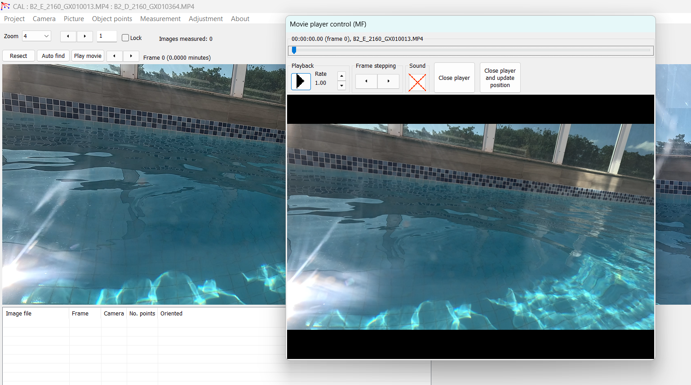

7.  Aumente o *Rate* para 5 (ou mude de acordo com a distância).

    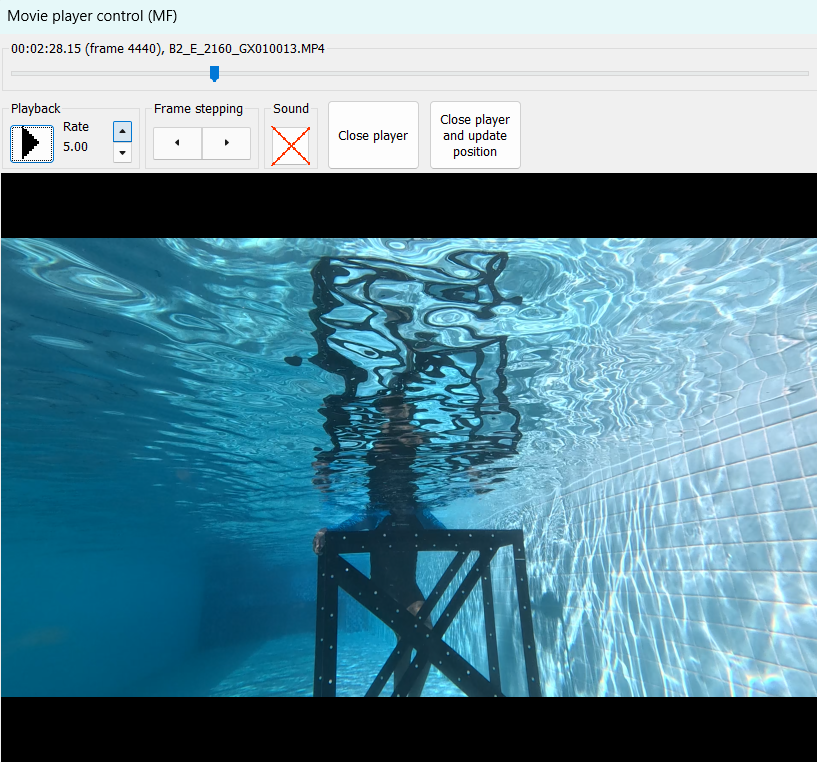

8.  Aperte *Playback* ▶️

9.  Agora busque o momento sublime do *clap* (ou *clap clap*).

    ::: {.callout-tip appearance="simple"}
    Não use a barra de rolagem do vídeo. Até dá para usar de forma grosseira para tentar chegar o mais perto do momento clap. Assim, que você tentar, verá que ela não tem movimentos preciso e atrapalha mais do que ajuda.
    :::

10. Quando passar ou estiver próximo, *Pause!*

11. Use o *Frame stepping* para avançar ou retroceder no momento antecessor ao *clap*.

    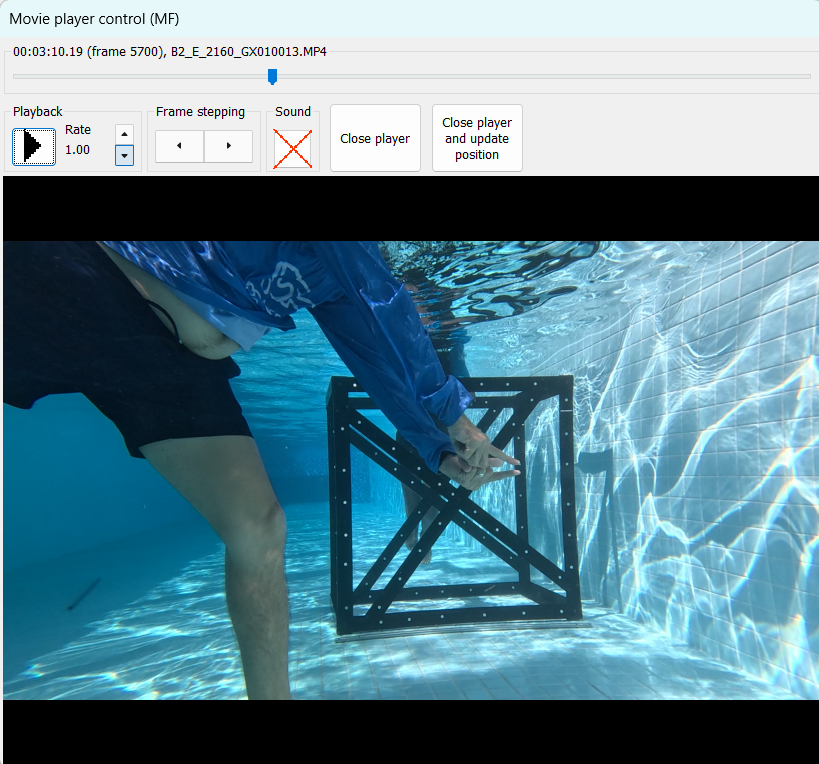

12. Agora reduza o *Rate* para 1 e vá avançando no *Frame stepping* até o momento *clap* e clique em *Close player and update position*.

    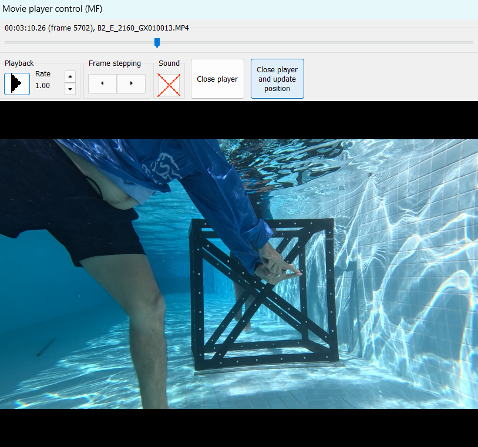

13. Agora faça o mesmo para a câmera da direita. Aperte *Play movie*.

    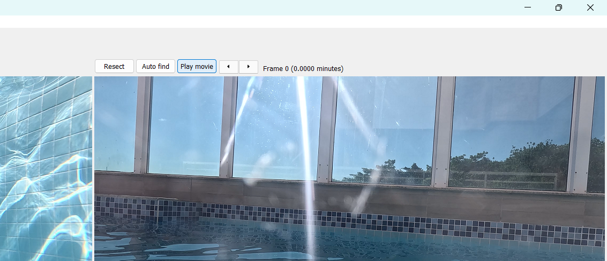

14. Encontre o momento *clap* e cliquei em *Close player and update position*

    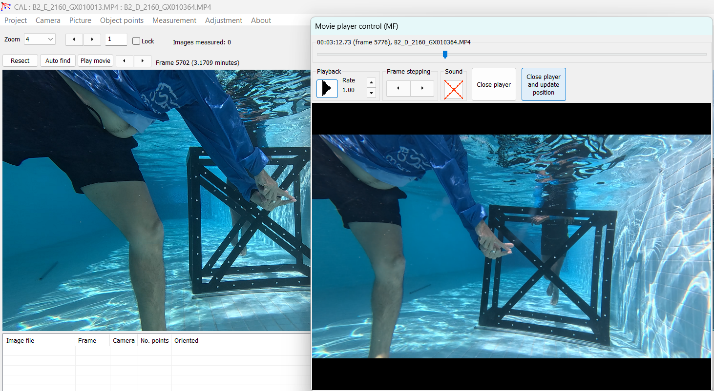

15. Agora sim, começaremos os trabalhos.

16. Ative o botão *Lock*

    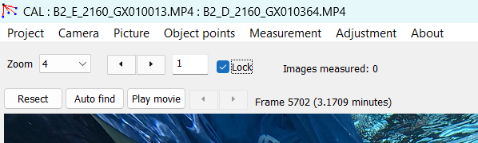

17. Aperte *Play movie* na câmera esquerda, abrirá a janela do *Movie player control*. Aumente o *Rate* (ex: 3) e clique em *Playback* ▶️. Pause no momento que antecede os movimentos sequenciais (são 20 ao todo) que o quadrado de calibração precisa fazer para calibrar (Ver manual).

    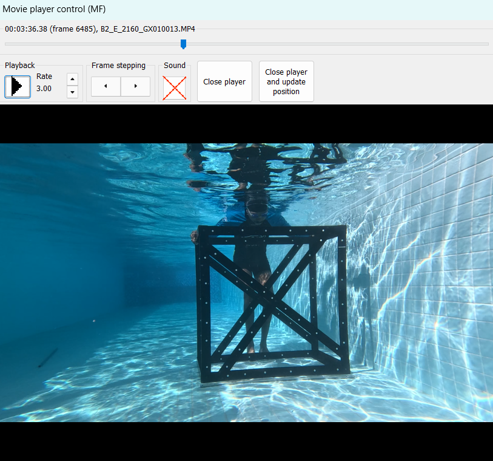

    ::: {.callout-caution appearance="simple"}
    Perceba que na situação ilustrativa acima, o quadro de calibração se encontra relativamente distante em relação as câmeras. É preciso buscar um melhor enquadramento.
    :::

18. Aperte *Close player and update position* e perceba que ambas as câmeras irão atualizar para o frame em questão. Isso se deve por termos selecionado o botão *Lock*.

## Começando os trabalhos

1.  Agora, vamos começar marcar os pontos. Comece pelo frame da câmera esquerda. Este processo precisara se feitos em ambas as câmeras (02) para cada sequência de frame (20), no mínimo (20\*2=40), seguindo o esquema de ponto, **conforme o modelo do seu cubo de calibração** (Ex: Cubo 142, abaixo):

    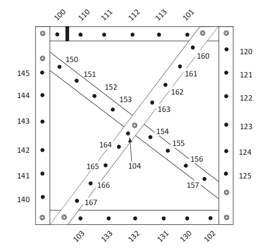

2.  Começe pelo ponto 100, que enontra-se justo acima da linha de referência. Depois siga para o 101, 102, 103 e 104, estes são os **pontos de** [^1] (*ressection points*). A partir daí, 110 em diante. Você perceberar que essa sequência já está pre programada dentro do programa.

    ::: {.callout-tip appearance="simple"}
    Utilize o material de apoio que eleboramos para você não se perder, tanto na sequência do quadrado como na posição dos pontos (POR LINK).
    :::

3.  Um dica é apertar *Ctrl* no teclado e avançar com o mouse para frente, isso irá dar zoom.

    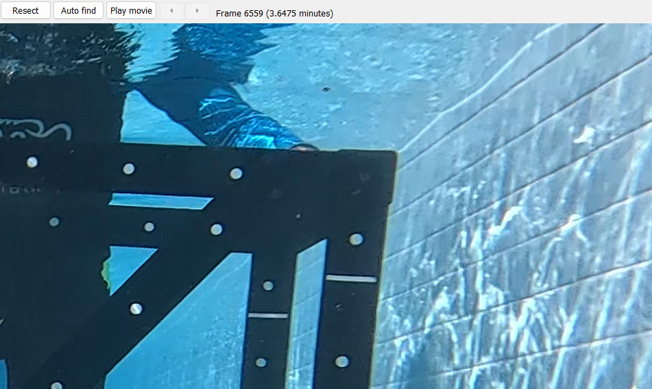

    ::: {.callout-warning appearance="simple"}
    É, não dá para usar a bala de rolagem do mouse.
    :::

4.  Aperte *Shift* e um pequeno quadrado irá aparecer, este é o **Centroíde.**

    

    ::: {.callout-note appearance="simple"}
    O centróide serve como um alvo que facilita a realização da medida. Realizar a medida via centróide é 10x melhor do que realizar apenas clicando diretamente (*point and click).*
    :::

5.  Ainda com o *Shift* pressionado, aponte a flecha do mouse no centro e clique com o botão esquerdo do mouse para marcar um ponto.

    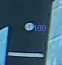

6.  Marque os pontos ressecionáis (conforme já mencionado anteriormente).

7.  Em um determinado momento o CAL irá tentar plotar os demais pontos automáticamente.

    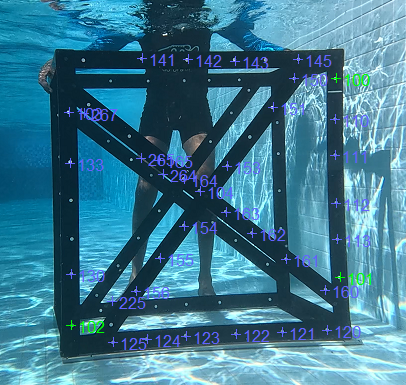

    ::: {.callout-note appearance="simple"}
    Ele acertará muitos e errará outros tantos. Alguns ele não irá encontrar, em especial os do segundo plano (200, 201...). Independente disso você terá que verificar e corrigir cada um deles pontualmente.
    :::

8.  Pontos ressecionáis (100,101,102,103 e 104) verdes indicam que foram bem calibrados.

    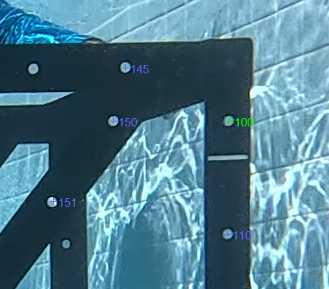

9.  Quantos mais pontos verdes em cada frame, melhor!

10. Se o ponto gerado pelo CAL cair no lugar errado, delete.

    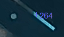

11. Ponha o cursor do mouse sobre o ponto e clique com o botão direito do mouse.

    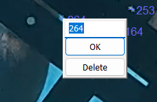

12. Plote você manualmente. Zoom in (Ctrl+mouse) \> Centroiding (Shift) \> Point (mouse esquerdo)

13. Provavelmente sairá outra numeração que não a correta. 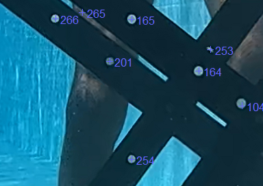

14. Clique com o botão direito do mouse sobre ele e renomei para a numeração que você achar que é. Aperte \*OK\*.

    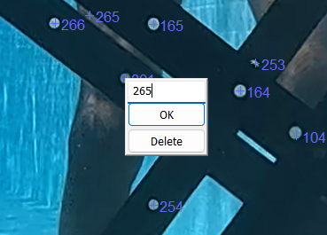

15. Tente encontrar o máximo de pontos que conseguir. As informações ficaram registradas abaixo da tela esquerda:

    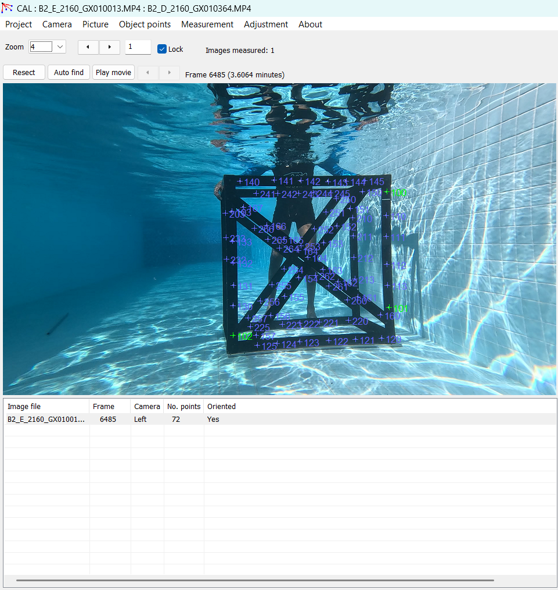

16. Quanto mais pontos (*No. points*) encontrar, mais preciso será a calibração, em teoria.

[^1]: Ressecção: É uma processo/ técnica da visão computacional e fotogrametria utilizada para determinar a posição e orientação da câmera no espaço a partir de pontos conhecidos no mundo (objeto).

```         
::: {.callout-tip appearance="simple"}
Particurlamente, busco frames que me permitam acima de 70 pontos. Contudo, caso o frame em questão não atinja tal valor, siga com a calibração até o fim e caso não alcance uma boa precisão ao final, busque novos frames que permita acima de 70 ponto, para cada posição do cubo. 
:::
```

17. Pontos ressectíveis vermelhos é um mau sinal. Quanto maior o número deles pior.

    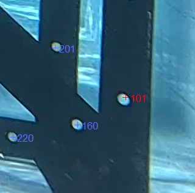

18. Após realizar a marcação de ambos os frames (Esquerda e Direita), siga para uma nova posição do cubo, conforme traz o manual de calibração:

    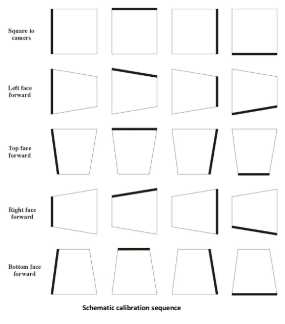

19. Para isso, aperte mais uma vez o botão *Play movie* e a janela do *Movie player control*, aperte *Playback* ▶️ para o video seguir seu curso. Aperte *Pause* quando o cubo estiver na próxima posição da sequência de calibração e aperte *Close players and update position*.

    ::: {.callout-important appearance="simple"}
    Pause no ângulo que maximize a exposição dos pontos do plano posterior (201, 202...), evitando que as barras do primeiro plano se sobreponha as pontos do segundo plano. Contudo, em alguma das câmera sempre haverá algum ponto que será coberto.
    :::

    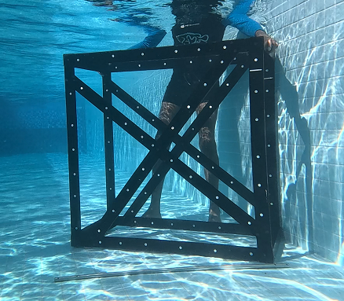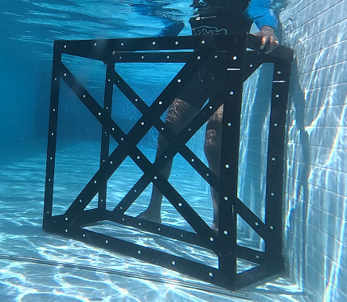

20. Remarque todos os pontos mais uma vez (Esquerda e Direita) e repita a operação para toda a sequência de posições do cubo. 😅

21. Um dica para não se perder no processo é ir marcando as posições do cubo que já foram realizadas, conforme abaixo:

    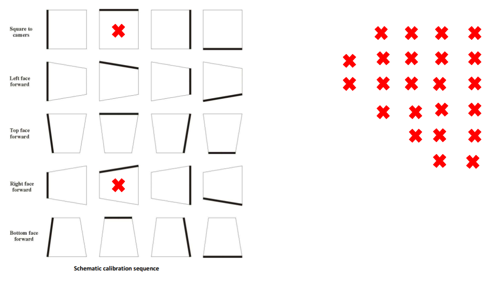

22. Tenho esse arquivo (.ppt) disponível para ser compartilhado no drive do PMB.

23. As linhas pretas representam a linha branca de referência do cubo. Por exemplo, a imagem abaixo representa a quarta linha da segunda coluna do esquema de calibração ilustrado acima.

    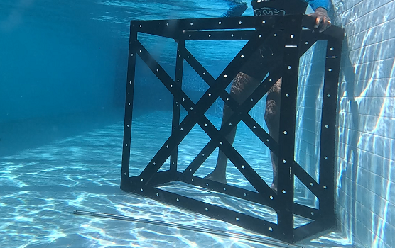

24. Atenção! Durante as operações de piscina, o operador do cubo e o supervisor da operação precisam tem muito cuidado durante o manuseio do cubo para que as mão do operador não cubram algum dos pontos do cubo. Conforme aconteceu abaixo, onde a mão direita do operador está encobrindo o ponto 240:

    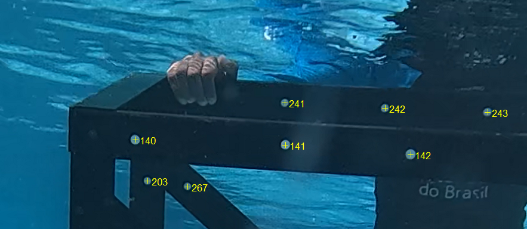

## Mudando as cores

Você pode mudar as cores dos pontos, já que a cor dos pontos não residuais (pontos azuis) é de difícil distinção no fundo azul da piscina. Isso irá ajudar a minimizar os erros. Se quiser mudar, vá em *Ajustement* \> *Point colors...*

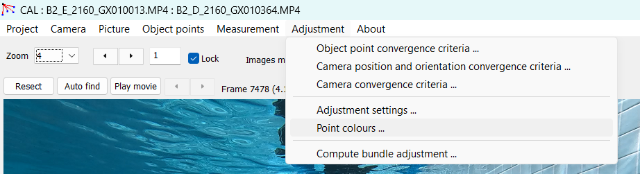

Uma pequena janela se abrirá mostrando as cores padrões:

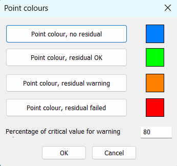

Clique em *Point colour, no residual* e altere para a cor que desejar (ex: amarelo):

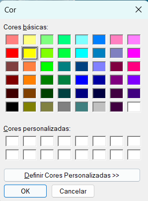

Antes:

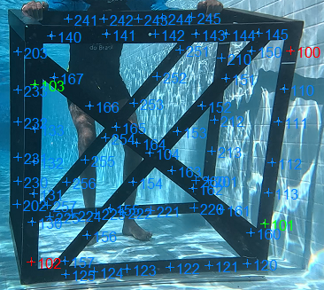

Depois:

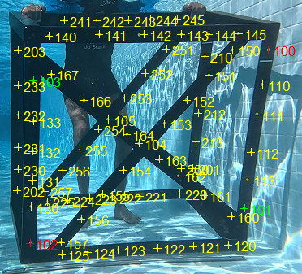

## Finalizando os trabalhos

1.  Ao final do processo de medição (marcações de pontos), você deverá ter um total de 40 images (20 câmera esquerda e 20 câmera direita). Você poder ver isso na própria tela principal do programa, onde há um campo descrito como *Images measured:*

{fig-align="center"}

2.  Estando tudo certo, iremos partir para o **ajuste do feixe**[^2] ou *bundle adjustment.*

3.  Mas antes é importante saber que você pode ajustar os parâmentros do ajuste (*bundle adjustment*) no menu *Adjustment \| Adjustment setting...*

    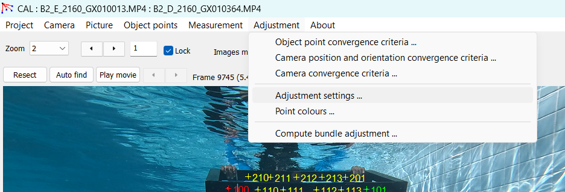

4.  Acho que o mais importante aqui é avisar ao programa que estamos utilizando um sistema estéreo (*Stereo*-BRUV) e, portanto, exigir dele um restrição estéreo (*stereo constraint*)

    ::: {.callout-tip appearance="simple"}
    Se você não sabe se o BRUV que está utilizando é estéreo, assista esse pequeno vídeo para noções basicas de fotogrametria: <https://www.youtube.com/watch?v=BZdzyzMjAjc>
    :::

5.  Clicando em *Adjustment \| Adjustment setting*, abrirá um a janela (*Adjustment and photogrammetry settings)* contendo uma tabela com quatro colunas:

    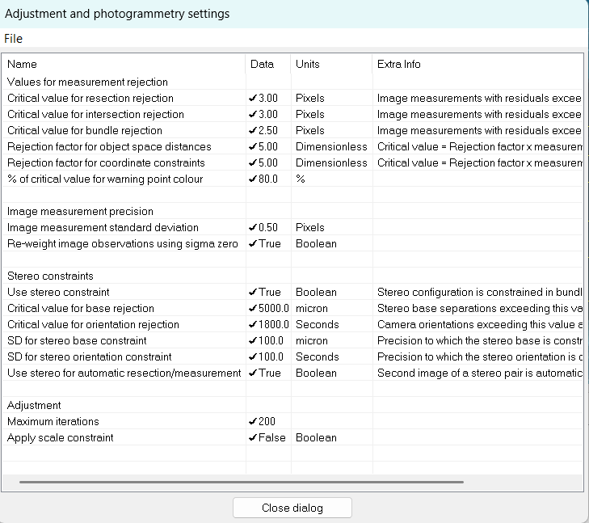

6.  Perceba que essa tabela possui quatro seções:

    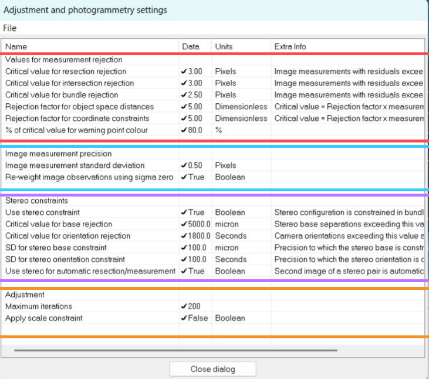

7.  Na seção roxa ou 3° seção (*Stereo constraints*), temos na primeira linha (*Use stereo constraint)* como padrão (*default*), *False.*

[^2]: Ajuste do Feixe: Tradução livre de *Bundle Adjustement,* termo utilizado na área de fotogrametria e visão computacional que se refere a um processo de otimização matemática para melhorar a reconstrução 3D de uma cena a partir de multiplas imagens. Tecnicamente, é um problema de mínimos quadrados não lineares, onde minimiza-se o erro da reprojeção.

```         
::: {.callout-warning appearance="simple"}
Perceba que isso que falo não está expresso nas duas ultimas fotos anteriores, pois já havia realizado a mudança quando realizei o recorte, mas mantive para me poupar trabalho.
:::
```

8.  Selecione a célula da coluna *Data* e mude para ***True*** (escreva!).

    .png)

9.  Isso impõe condições matemáticas ao *bundle adjustment* que obrigam os pares de imagens (esquerda/direita) a manter a mesma orientação relativa ao longo de todo conjunto de imagens, forçando consistência na geometria relativa entre as duas câmeras (par estéreo).

10. Se esse for seu caso (Stereo-Bruvs), feito isso, seguimos para o ajuste de feixe.

### Ajuste do Feixe

1.  Após concluir todas as medições (marcações de pontos), calcule o ajuste do feixe usando *Adjustment* \| *Compute bundle adjustment...*

    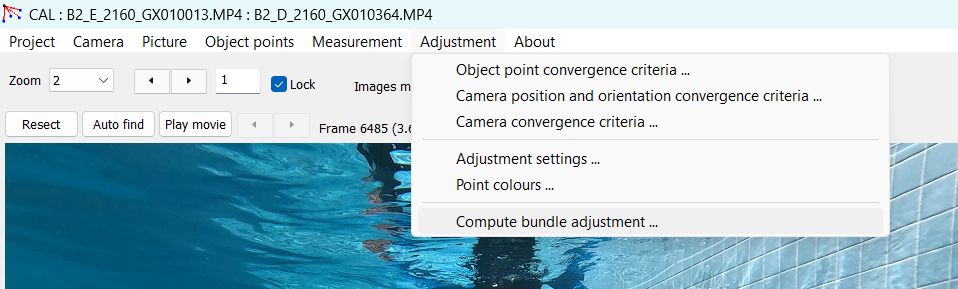

    ::: callout-note
    O QUE É "FEIXE" (*BUNDLE*)?

    Cada ponto 3D projeta um conjunto de linha (x, y, z) (ou um feixe/ pacote de raios) em direção às diferentes câmeras.
    :::

2.  Se você receber uma mensagem de aviso sobre medições de distância excluídas ou baixa precisão relativa, ignore-a por enquanto. Se o ajuste falhar, consulte os motivos pelos quais um ajuste de feixe pode falhar. Se ainda estiver com dificuldades para obter resultados que não convergem, tente uma solução apenas com a face frontal, descrita em Ajustes com falha em um cubo de calibração SeaGIS.

## Glossário

Ajuste do Feixe: Tradução livre de *Bundle Adjustement,* termo utilizado na área de fotogrametria e visão computacional que se refere a um processo de otimização matemática para melhorar a reconstrução 3D de uma cena a partir de multiplas imagens. Tecnicamente, é um problema de mínimos quadrados não lineares, onde minimiza-se o erro da reprojeção.
